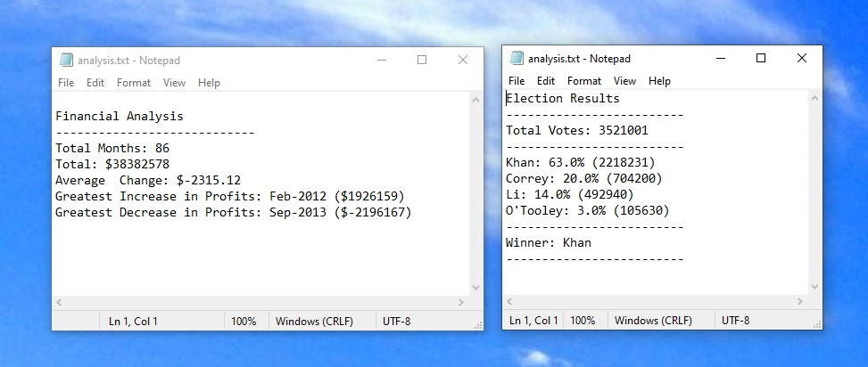
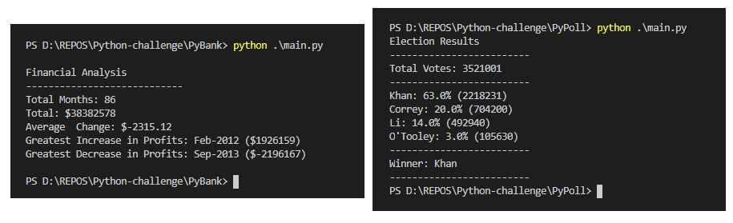

# Python Homework - Py Me Up, Charlie

ScreenShots for .txt output


Terminal output screenshots


The rest of required results - is in the appropriate folders of the repo.

## PyBank code

```python:
import os                                                       #call libraries and variables initiate
import csv
monthCount = 0
totalCount = 0
deltaTotal = 0
previousProfit = 867884
maxDelta = 0
minDelta = 0

csvpath = os.path.join("Resources", "budget_data.csv")          #asemble  filename
with open(csvpath, 'r') as csvfile:                             #open file
    csvreader = csv.reader(csvfile, delimiter=',')              #read csv
    csv_header = next(csvreader)                                #discard header
    for row in csvreader:                                       #going though rows of data
        monthCount += 1                                         #counting months
        totalCount += int(row[1])                               #running total for profits
        deltaProfit = int(row[1]) - previousProfit              #profit change since last month
        deltaTotal += deltaProfit                               #running sum of delta profit
        previousProfit = int(row[1])
        if deltaProfit > maxDelta:                              #if new max found - rewrite and save time
            maxDelta = deltaProfit
            maxMonth = row[0]
        if deltaProfit < minDelta:                              #if new min found - same
            minDelta = deltaProfit
            minMonth = row[0]

#asemble an answer in multiline f-string:
answerString = f"""
Financial Analysis
----------------------------
Total Months: {monthCount}
Total: ${totalCount}
Average  Change: ${round(deltaTotal / (monthCount - 1),2)}
Greatest Increase in Profits: {maxMonth} (${maxDelta})
Greatest Decrease in Profits: {minMonth} (${minDelta})
"""
print(answerString)                                             #print answer to terminal

answerPath = os.path.join("analysis","analysis.txt")            #overwrite file with the new answer
f = open(answerPath, "w")
f.write(answerString)
f.close()                                                       #close and save
```
## PyPoll code

```python:
import os                                                       #call libraries and variables initiate
import csv
votesCount = 0
candidates = {}
winner = ['null',0]

csvpath = os.path.join("Resources", "election_data.csv")        #asemble  filename
with open(csvpath, 'r') as csvfile:                             #open file
    csvreader = csv.reader(csvfile, delimiter=',')              #read csv
    csv_header = next(csvreader)                                #discard header
    for row in csvreader:                                       #going though rows of data
        votesCount += 1
        if candidates.get(row[2],'NYE') == 'NYE':               #if Not Yet Encountered name - add it to the dictionary
            candidates[row[2]] = 1
        else:                                                   #If already have this name Votes++
            candidates[row[2]] += 1           

#asemble an answer in multiline f-string:
answerString = f"""Election Results
-------------------------
Total Votes: {votesCount}
-------------------------\n"""
for key in candidates:
    answerString = answerString + str(key) + ': ' + str(round((candidates[key] * 100/votesCount),3)) + '% (' + str(candidates[key]) + ') \n'
    if candidates[key] > winner[1]:                             #good time to find winner while going through candidates results
        winner[0] = key
        winner[1] = candidates[key]
answerString += f"""-------------------------
Winner: {winner[0]}
-------------------------"""

print(answerString)                                             #print an answer to the terminal
answerPath = os.path.join("analysis","analysis.txt")            #overwrite file with the new answer
f = open(answerPath, "w")
f.write(answerString)
f.close()                                                       #close and save
```
